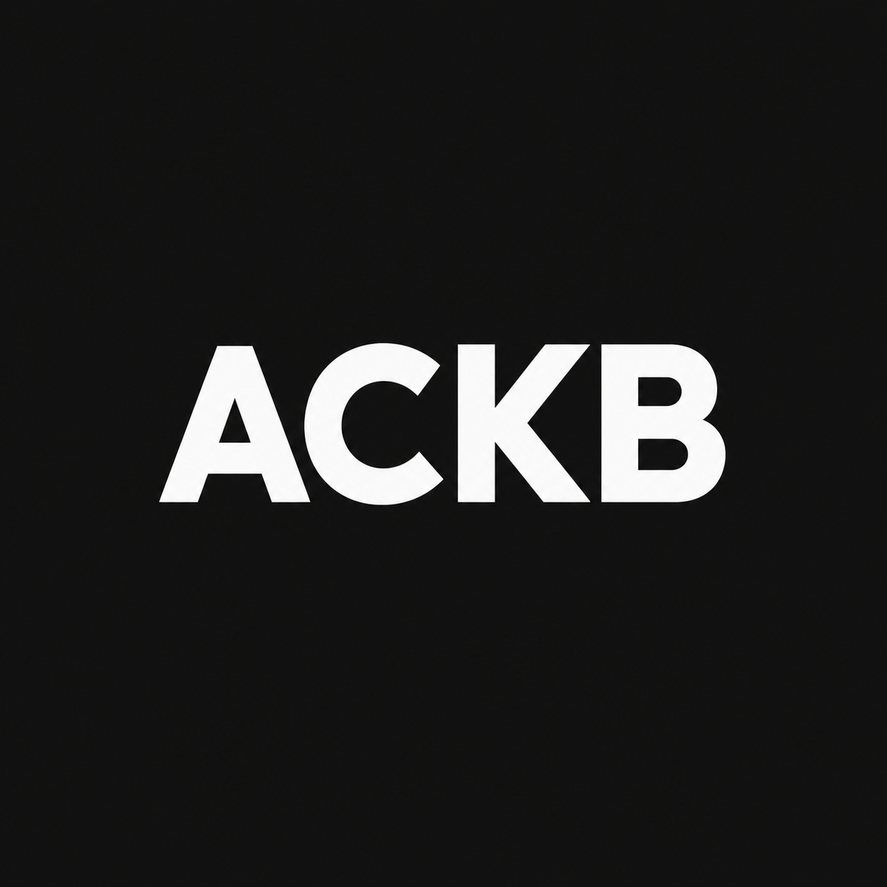

<p align="center">
  
</p>

<h1 align="center">ACKB · Analog Circuit Knowledge Base</h1>

<p align="center">
  A curated, searchable index of the best resources on synthesizer circuits.<br>
  <a href="https://marvinhauke.github.io/ackb/"><b>Open the live site →</b></a>
</p>

---

## What it is

ACKB collects articles, schematics, videos, papers and repos on synth circuits (analog, digital
or mixed). It doesn't copy anything: every result links straight to the original. Each link has
a short summary in our own words, plus tags.

## What's inside

Each link is one **article**, and its tags connect it to others to form a small knowledge graph.

| Tag type      | Examples                                        |
| ------------- | ----------------------------------------------- |
| Instrument    | Korg › MS-20, Moog › Minimoog, Buchla › 259     |
| Module        | VCO, Filter, VCA, FX › Delay & Reverb           |
| Subcircuit    | OTA stage, Sallen-Key, exponential converter    |
| Function      | Resonance, soft clipping, tap tempo             |
| Component     | LM13700, CEM3320, vactrol                       |
| Author        | René Schmitz, Electric Druid, Moritz Klein      |
| Resource kind | Build Guide, Explanation, Analysis, Schematic, Reference |

## Finding things

- **Search** for anything: `MS-20`, `LM13700`, `buffer`, …
- **Filter** in the sidebar: instrument, module, electronics and resource kind, combined freely.
- **Browse** tag pages such as [`/component/ca3080`](https://marvinhauke.github.io/ackb/component/ca3080)
  or [`/module/fx/delay`](https://marvinhauke.github.io/ackb/module/fx/delay): facts, related tags
  and all their articles.
- **Hide** forum threads or plain-http sites; your browser remembers the choice.
- **Basics** like op-amps or filter theory: tag and article pages offer general electronics
  [references](https://marvinhauke.github.io/ackb/references) under "Need the basics?".

## Can I trust it?

- **Confidence** comes from the source: `official` (datasheets, manuals), `academic` (papers,
  lectures) or `community`.
- **Link checks** run weekly, and dead links fall back to an archive.org copy.
- **Source rules** decide what gets in, and CI checks every pull request
  ([docs/source-rules.md](docs/source-rules.md)).

## Open data

Everything can be downloaded as static files, for tools and AI:

| File                           | Contents                          |
| ------------------------------ | --------------------------------- |
| `data/kb.jsonl`                | all articles, one per line        |
| `data/graph.json`              | the knowledge graph               |
| `data/taxonomy.json`           | all tags                          |
| `data/<type>/<path>.json`      | one tag, e.g. `data/component/ca3080.json` |
| `llms.txt`                     | a site map for language models    |

## Contributing

One JSON file per link in `data/articles/`: `npm run new -- "Title"` creates it,
`npm run check` validates it. See [adding articles](docs/adding-articles.md) and
[taxonomy](docs/taxonomy.md).

## Run locally

```bash
npm install
npm run dev
```

Node 22+. More: [architecture](docs/architecture.md) · [roadmap](docs/roadmap.md)
